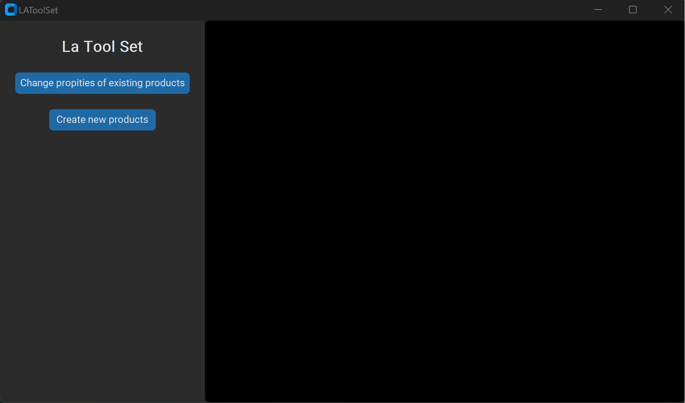
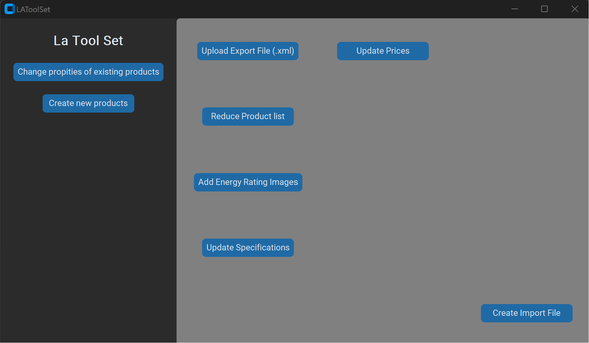
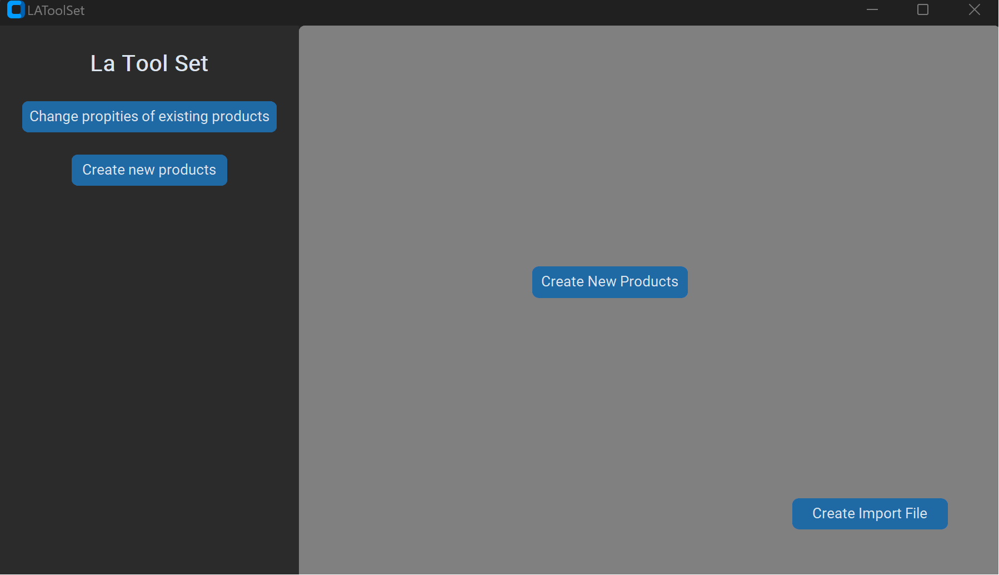

# Lawson Air Tool Set (LAToolSet)

This program was developed as an in house tool for automating the different tasks involved in maintaining and creating new air conditioning product series on the companies websites.
The program work alongside the **.xml** exporting and importing templates within the cpanel of the websites.



###
## Installation
Install modules using pip:
```
pip install customtkinter
pip install 
pip install lxml.etree
pip install pandas
pip install beautifulsoup4
```
# Updating and Changing Pre-existing products:

By using an **.xml** export file and a **.csv** file the program can change/update different aspects of products. These changes are then exporting as a new **.xml** file for importing to either of the websites.


&nbsp;

&nbsp;


# Creating New Products
&nbsp;

